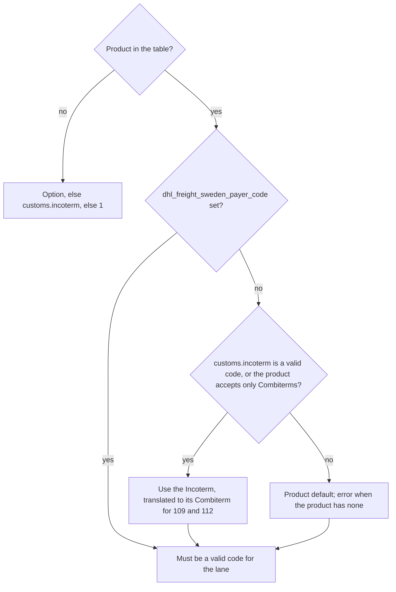

The connector checks these rules before it sends the booking request, and a violation fails with a `SHIPPING_SDK_FIELD_ERROR` whose `details` are keyed by the option or field to fix.
The README's errors reference lists every such error.
Manual references are to [product manual v5.26](../development/index.md#product-manual-citations), written `§x.y pN`.
Customs rules are in the README's exporting section, and destination rules (the EU VAT area, special territories, and excluded postal codes) are in [Destinations](destinations.md).

## Product lanes

A product books only from the shipper's country to the recipient's on a lane its valid countries in the manual allow, comparing territory codes as their parent country; [Products](products.md#lanes) lists the lanes.
Another lane fails with `ProductLaneError`, for example "Product 107 does not ship from CH to SE (product manual v5.26 §5.15 p66)", keyed by `shipper.country_code` when no lane starts in the shipper's country and by `recipient.country_code` otherwise.

## Customer numbers

The Consignor party id carries the DHL customer number, and DHL Freight Sweden books products in two systems that number customers separately.
The [IFTMIN shipment instruction v3.7](../development/index.md#iftmin-shipment-instruction-citations) addresses 102, 103, 107, 109, 112, 118, 209, 210, 211, 212, 401, 402, and 502 to one system and 202, 205, 233, 601, and SPI to the other (p10), and the manual's "DHL account number format" rows agree.

| Products | Account number format | Setting | Manual |
|----------|-----------------------|---------|--------|
| 102, 103, 104, 109, 112, 118, 209, 210, 211, 212, 401, 402, 502 | 6 digits | `account_number` | §5.2 p15, §5.12 p57, §5.13 p60, §5.14 p63, §5.3 p19, §5.16 p69, §5.5 p27, §5.6 p30, §5.7 p35, §5.8 p39, §5.17 p73, §5.18 p77 |
| 107 | none in §5.15 | `account_number` | §5.15 pp65-67 |
| 202, 205, 233, SPI, 601 | up to 35 alphanumeric characters | `international_account_number` | §5.4 p24, §5.9 p43, §5.10 p48, §5.11 p53, §5.19 p83 |

The IFTMIN addresses 104 to a third recipient, DPST, and the connector sends 104 the domestic number that its 6-digit format row asks for.
An international product without `international_account_number` fails with `InternationalAccountNumberError` keyed by `international_account_number`.
The vendored Transport Instruction API spec 2.10.0 caps the party id at 15 characters, below the manual's 35, so an international number longer than 15 characters fails with the same error; a domestic booking ignores the international number.
The sandbox does not check which number a product receives: it accepted the domestic customer number on 202 ([booking-2906762121-202-se-dk.json](../../tests/dhl_freight_sweden/fixtures/sandbox/booking-2906762121-202-se-dk.json)), 233 ([booking-2906762147-233-se-dk.json](../../tests/dhl_freight_sweden/fixtures/sandbox/booking-2906762147-233-se-dk.json)), and 601 ([booking-2906761248-601-se-dk.json](../../tests/dhl_freight_sweden/fixtures/sandbox/booking-2906761248-601-se-dk.json)).

## Payer codes

`payerCode` carries the product's terms-of-delivery code, validated against the product's "Payer codes" table.

| Product | Valid codes | Default | Manual |
|---------|-------------|---------|--------|
| 102, 210, 211, 212 | 1, 3, 4 | 1 | §5.2 p15, §5.6 p30, §5.7 p35, §5.8 p39 |
| 209 | 1, 3, 4, 8 (manual invoicing, separate agreement needed) | 1 | §5.5 p27 |
| 103, 118, 401 | 1, 4 | 1 | §5.12 p57, §5.16 p69, §5.17 p73 |
| 104 | 3 | 3 | §5.13 p60 |
| 402, 502 | 3, 4 | none | §5.18 p77 |
| 107 | 001 | 001 | §5.15 p66 |
| 109 | 022, 023 (023 only with customs joint declaration) | 022 | §5.14 p63 |
| 112 | 022, 023 | 023 | §5.3 p19 lists 023 only; 022 per the sandbox, see below |
| 202, 233, SPI, 601 | export EXW, FCA, CPT, CIP, DAP, DPU, DDP; import EXW, FCA | none | §5.4 p24, §5.10 p48, §5.11 p53, §5.19 p83 |
| 205 | export CPT, CIP, DAP, DPU, DDP; import EXW, FCA | none | §5.9 p43 |

A lane is an import when the recipient is in SE and the shipper is not; the import column applies only to the products that list one.
The code resolves in this order:

The Combiterm translation follows §7.6 p163: CPT, CIP, DAP, and DPU become 022, and DDP becomes 023.

Payer code 023 on 109 additionally requires the `dhl_freight_sweden_customs_joint_declaration` option.
The manual conflicts with itself here: the 109 section requires the joint declaration for 023 (§5.14 p63), while the joint declaration section says such bookings must not be sent for 109 and 112 (§6.8 p98).
The connector follows §5.14, and the question is open with DHL.

For 112 the connector accepts 022 as well as the manual's 023, because the sandbox accepted both while rejecting payer code 1, and the Product API catalog's Incoterm codes for 112 reach it only through the Combiterm translation ([022 accepted](../../tests/dhl_freight_sweden/fixtures/sandbox/booking-2906761149-112-se-pl-payer-022.json), [023 accepted](../../tests/dhl_freight_sweden/fixtures/sandbox/booking-2906761131-112-se-pl.json), [1 rejected](../../tests/dhl_freight_sweden/fixtures/sandbox/rejection-22020-112-se-pl-payer-code-1.json), [catalog](../../tests/dhl_freight_sweden/fixtures/sandbox/lookup-products-109-112-payer-codes.json)).

## Access points

The `dhl_freight_sweden_service_point` options produce an AccessPoint party only where the manual lists an access-point delivery for the product and the recipient country.

| Product | Country | Sub types | Manual |
|---------|---------|-----------|--------|
| 103 | SE | ParcelShop, ParcelStation | §5.12 p55-56 |
| 109 | AT, BE, BG, CZ, DK, EE, FI, HU, IT, LT, LV, NL, PL, SK | ParcelShop, ParcelStation | Appendix C.3, §10.4.2 p192-194 |
| 109 | DE, ES, FR, GB, HR, NO, PT, RO, SI | ParcelShop | Appendix C.3, §10.4.2 p192-193 |

Every other product and country accepts no AccessPoint party, including 109 to IE and LU and all of 112 (§5.3 p19), for which DHL answers 22015 "AccessPoint Party is not allowed for this product" ([rejection-22015-112-se-pl-access-point.json](../../tests/dhl_freight_sweden/fixtures/sandbox/rejection-22015-112-se-pl-access-point.json)).
A `dhl_freight_sweden_service_point` value that is a sub type or location type name (`ParcelShop`, `ParcelStation`, `servicepoint`, `locker`, `postoffice`, `postbank`, in any case) is rejected: the option takes the service point id, and the sub type goes in `dhl_freight_sweden_service_point_type`.

Appendix M (§10.14.2.2 p232) states that the AccessPoint `subtype` carries the location type (`servicepoint`, `locker`, `postoffice`), while the transport-instruction booking spec enumerates `ParcelShop` and `ParcelStation`.
The connector sends `ParcelShop` and `ParcelStation`.
The sandbox accepted 109 bookings with `ParcelShop` to PL, RO, NO, and DK and with `ParcelStation` to a HU locker ([booking-2906761123-109-se-pl.json](../../tests/dhl_freight_sweden/fixtures/sandbox/booking-2906761123-109-se-pl.json), [booking-2906761263-109-se-ro.json](../../tests/dhl_freight_sweden/fixtures/sandbox/booking-2906761263-109-se-ro.json), [booking-2906761305-109-se-no.json](../../tests/dhl_freight_sweden/fixtures/sandbox/booking-2906761305-109-se-no.json), [booking-2906761354-109-se-dk.json](../../tests/dhl_freight_sweden/fixtures/sandbox/booking-2906761354-109-se-dk.json), [booking-2906761289-109-se-hu.json](../../tests/dhl_freight_sweden/fixtures/sandbox/booking-2906761289-109-se-hu.json)).

The connector sends the service point id as given and does not check the point's service types.
For 103 the manual says to use only the four-digit part nnnn of an id like SE-nnnn00 (§10.14.2.1 p231), while the sandbox accepted the full id SE-982000 ([booking-2906761230-103-se-se.json](../../tests/dhl_freight_sweden/fixtures/sandbox/booking-2906761230-103-se-se.json)).
For 109 the manual allows only shops and stations with service type `parcel:pick-up` (§10.14.2.2 p232), while the sandbox accepted the HU locker 8013-118530, whose lookup entry lists only `parcel:pick-up-unregistered` ([booking-2906761289-109-se-hu.json](../../tests/dhl_freight_sweden/fixtures/sandbox/booking-2906761289-109-se-hu.json)).

## SENT

Lanes with the shipper or the recipient in PL carry SENT entries under the shipment's `additionalInformation`.
The related-fields tables of 202 (§5.4 p23), 205 (§5.9 p42), 233 (§5.10 p47), SPI (§5.11 p52), and 601 (§5.19 p82) make the question "Is shipment SENT free?" (`SENT_FREE`) mandatory for shipments to or from PL, and the SENT reference and carrier key mandatory when the answer is no; the sections of 109 and 112 do not mention SENT.

| Option | Type | Sent as |
|--------|------|---------|
| `dhl_freight_sweden_sent_ref` | string, at most 20 characters | `SENT_REF` |
| `dhl_freight_sweden_sent_carkey` | string, at most 20 characters | `SENT_CARKEY` |
| `dhl_freight_sweden_sent_free` | boolean | `SENT_FREE` |

| Input | Result | Sandbox evidence |
|-------|--------|------------------|
| both identifiers | `SENT_FREE` `"false"`, then `SENT_REF` and `SENT_CARKEY`, as in the manual's API example (§5.4 p23) | [601 to PL, placeholder identifiers](../../tests/dhl_freight_sweden/fixtures/sandbox/booking-2906769654-601-se-pl-sent-identifiers.json) |
| one identifier without the other | fails | |
| free flag `true` and either identifier | fails as contradictory | |
| free flag `true` | `SENT_FREE` `"true"` | [109 to PL](../../tests/dhl_freight_sweden/fixtures/sandbox/booking-2906761123-109-se-pl.json), [112 to PL](../../tests/dhl_freight_sweden/fixtures/sandbox/booking-2906761131-112-se-pl.json) |
| free flag `false` without identifiers | fails | |
| neither | `SENT_FREE` `"true"`, whatever the weight | [601 to PL](../../tests/dhl_freight_sweden/fixtures/sandbox/booking-2906769647-601-se-pl-default-sent-free.json) |

The sandbox rejected a 109 booking to PL with no SENT entries with 22001 "SENT_REF and SENT_CARKEY are mandatory unless SENT_FREE is true." on 2026-10-05 and accepted the same request on 2026-10-08 ([rejection](../../tests/dhl_freight_sweden/fixtures/sandbox/rejection-22001-109-se-pl-without-sent.json), [booking](../../tests/dhl_freight_sweden/fixtures/sandbox/booking-2906769613-109-se-pl-without-sent.json)), and the connector still sends `SENT_FREE` `"true"` when no SENT option is given.
The vendored transport-instruction spec 2.10.0 defines the `AdditionalInformation` schema but does not reference it from the shipment; the live API accepts it at shipment level.

## EKAER and UIT

Lanes with the shipper or the recipient in HU carry EKAER entries, and lanes with the shipper or the recipient in RO carry UIT entries, under the shipment's `additionalInformation`.
EKAER is the Hungarian electronic road trade and transport control system, governed by decree 13/2020 (XII.23.) PM.
UIT is the transport identification code of the Romanian RO e-Transport system, governed by OUG 41/2022, art. 8^1.
The "Related fields" tables of products 202 (§5.4 p23), 205 (§5.9 p42), 233 (§5.10 p47), SPI (§5.11 p52), and 601 (§5.19 p82) list these entries for shipments to or from HU and RO.

| Option | Type | Sent as |
|--------|------|---------|
| `dhl_freight_sweden_ekaer_free` | boolean | `EKAER_FREE` |
| `dhl_freight_sweden_ekaer_number` | string, at most 20 characters | `EKAER_NUMBER` |
| `dhl_freight_sweden_uit_free` | boolean | `UIT_FREE` |
| `dhl_freight_sweden_uit_number` | string, at most 19 characters, e.g. `1234-5678-9012-3456` | `UIT_NUMBER` |

On 202, 205, 233, SPI, and 601 the options resolve as below, where the total gross weight is the sum of the shipment's parcel weights in kilograms.

| Input | Total gross weight | Result | Sandbox evidence |
|-------|--------------------|--------|------------------|
| free flag `true` | any | `EKAER_FREE` or `UIT_FREE` `"true"` | |
| number | any | the free code `"false"`, then `EKAER_NUMBER` or `UIT_NUMBER` | [601 to HU, placeholder EKAER number](../../tests/dhl_freight_sweden/fixtures/sandbox/booking-2906761339-601-se-hu.json), [601 to RO, placeholder UIT number](../../tests/dhl_freight_sweden/fixtures/sandbox/booking-2906769662-601-se-ro-uit-number.json) |
| free flag `true` and number | any | fails as contradictory | |
| number over its length limit | any | fails | |
| EKAER free flag `false` without a number | any | fails, because the manual marks the EKAER number mandatory for a shipment that is not EKAER free | |
| UIT free flag `false` without a number | any | `UIT_FREE` `"false"` alone, because the manual marks the UIT code conditional, "Code should be provided if possible" (e.g. §5.4 p23) | [601 to RO](../../tests/dhl_freight_sweden/fixtures/sandbox/booking-2906761347-601-se-ro.json) |
| neither | below 500 kg | `EKAER_FREE` or `UIT_FREE` `"true"`, following the manual's "to/from" wording | 601 to [HU](../../tests/dhl_freight_sweden/fixtures/sandbox/booking-2906769555-601-se-hu-default-ekaer-free.json) and [RO](../../tests/dhl_freight_sweden/fixtures/sandbox/booking-2906769563-601-se-ro-default-uit-free.json), 202 to [HU](../../tests/dhl_freight_sweden/fixtures/sandbox/booking-2906769969-202-se-hu-default-ekaer-free.json) and [RO](../../tests/dhl_freight_sweden/fixtures/sandbox/booking-2906769977-202-se-ro-default-uit-free.json), 233 to [HU](../../tests/dhl_freight_sweden/fixtures/sandbox/booking-2906769985-233-se-hu-default-ekaer-free.json) and [RO](../../tests/dhl_freight_sweden/fixtures/sandbox/booking-2906769993-233-se-ro-default-uit-free.json) |
| neither | 500 kg or more | fails with `TransportDeclarationError`, asking for `dhl_freight_sweden_ekaer_number` or `dhl_freight_sweden_uit_number`, or an explicit free flag | |

On other products the options are optional and sent when given, and the sandbox accepted 109 and 112 bookings to HU and RO without these entries ([109 to RO](../../tests/dhl_freight_sweden/fixtures/sandbox/booking-2906761263-109-se-ro.json), [112 to RO](../../tests/dhl_freight_sweden/fixtures/sandbox/booking-2906761271-112-se-ro.json), [109 to HU](../../tests/dhl_freight_sweden/fixtures/sandbox/booking-2906761289-109-se-hu.json), [112 to HU](../../tests/dhl_freight_sweden/fixtures/sandbox/booking-2906761297-112-se-hu.json)).

## Transport declaration defaults

SENT free, EKAER free, and UIT free are legal declarations made on the shipper's or the consignee's behalf, and the connector makes them by default only because they suit typical e-commerce shipments.
The defaults are not customs or tax advice, and the consumer of the connector, the integrator or the shipper, is responsible for every declaration sent, including the defaults, and for the consequences of misconfigured usage.
DHL charges fines and missing-information fees to the booking party.
The sandbox accepted placeholder SENT, EKAER, and UIT identifiers (see the tables above), so it does not show whether DHL checks them; the connector checks only their length and combination.

DHL describes SENT from 17 March 2026 as covering B2B shipments of clothing (CN 61, 62, and 6309) over 10 kg gross per shipment and of footwear (CN 64) over 20 items, declared by the receiver in PL, and states "B2C = no SENT ever" ([DHL Global Forwarding Poland](https://www.dhl.com/pl-en/home/global-forwarding/latest-news-and-webinars/poland_sent_2026.html), [DHL Express Poland](https://dhlexpress.pl/en/sent-2/)).
Those sources do not cover the older SENT goods categories, such as fuels; a shipment of such goods, or a B2B shipment above those thresholds, needs `dhl_freight_sweden_sent_ref` and `dhl_freight_sweden_sent_carkey`, and identifying it is the consumer's responsibility.
The UIT exception covers goods with a value less than 10,000 RON and a weight less than 500 kg ([DHL Denmark](https://www.dhl.com/dk-en/home/about-us/local-news/071024.html)); the connector checks the weight only, not the value.
The EKAER thresholds for risky products, a fiscal-risk product list that is distinct from ADR dangerous goods, are 500 kg and HUF 1,000,000 ([RSM Hungary](https://www.rsm.hu/tax-to-know/ekaer-obligation)); the connector checks the weight only and cannot detect whether goods are risky products.

## VAT number/TIN for GR

Products 202 (§5.4 p22), SPI (§5.11 p51), and 601 (§5.19 p81) make a VAT number/TIN mandatory for all parties in the shipment information of shipments to or from Greece (GR).
The connector transmits two parties, the shipper as Consignor and the recipient as Consignee, each with its `federal_tax_id`, else its `state_tax_id`, as `vatEoriSocialSecurityNumber`.
On these products, a shipment with the shipper or the recipient in GR fails when either party has neither identifier, with `details` keyed by `shipper.federal_tax_id` or `recipient.federal_tax_id`.
Other products and lanes send the identifiers when given and do not require them.
No GR booking has been sent to the sandbox.

## QR code for 107

Product manual v5.26 offers a QR code for Parcel Return Connect (107), shown by the consumer when handing over the return parcel, through the print API selection `"qrCode": true`, valid for BE, BG, CZ, DE, ES, LU, and PT (§5.15 p65), the countries a 107 return is sent from.
The `dhl_freight_sweden_qr_code` option `true` adds `qrCode` `true` to the print-by-id options of 107 shipments whose shipper is in one of these countries.
On other products or from other countries the option fails with `details` keyed by `dhl_freight_sweden_qr_code`, as access points do where the manual lists none, and `false` or no option requests no QR code.
The vendored print spec 2.10.0 defines `qrCode` as a print option, but its `PrintResult` is a list of reports with `name`, `content`, `contentType`, and `type`, and it does not say how a QR code report is named, typed, or ordered.
The connector returns the first report as the label and does not surface a QR code document; no 107 booking with `qrCode` has been sent to the sandbox.

## Additional information pass-through

The `dhl_freight_sweden_additional_information` option passes further entries through, as a list of `{"code": ..., "stringValue": ...}` objects (`dateValue` and `numericValue` are also accepted).
Entries follow the SENT, EKAER, and UIT entries.
An entry without a code fails, and so does an entry with a SENT, EKAER, or UIT code on a lane where the typed options of that family apply (PL, HU, or RO respectively); on other lanes these codes pass through.
