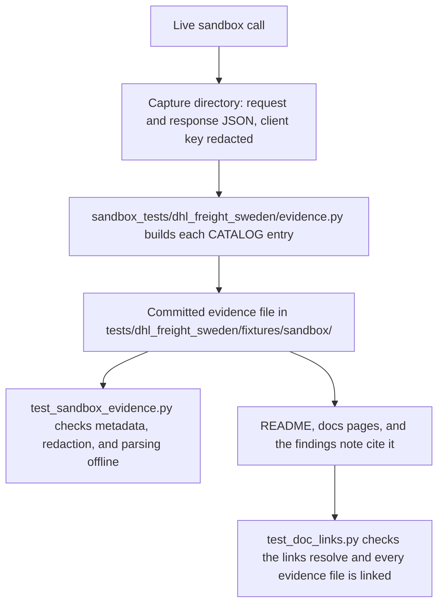

`sandbox_tests/` holds a suite that calls the DHL Freight SE sandbox, so the connector's rules stay anchored to live behaviour.
It is opt-in and sits outside `tests/`, so the default offline run never discovers it, and the wheel does not ship it.
[Running the sandbox suite](../../guides/sandbox-runs.md) covers credentials, variables, the booking budget, and narrowing a run.

## Segments

| Segment | Books | Covers |
|---------|-------|--------|
| `lookups` | nothing | PostalCode routes, `enforce` pre-flight, product matches including [special territories](../../concepts/destinations.md#special-territories), service points |
| `booking-approved` | 102, 401, 601, 118 | SE and DK lanes, 118 pre-flight, labels |
| `booking-pudo` | 103, 109 | service point as AccessPoint party |
| `booking-export` | 109, 112, 202, 205, 233, 601 | export lanes, special territories, customs handling |
| `booking-declarations` | 601, 202, 233 | SENT, EKAER, and UIT entries |
| `rejections` | nothing accepted | expected DHL error codes |

Before each booking a free product-match lookup, and for 109 a service-point lookup, checks that DHL offers the product on the lane, and the case skips otherwise; the few cases that book past this check exist to record DHL's answer.
The `rejections` cases build a valid request through the connector and `harness.mutated_request` changes the serialized TransportInstruction just before the call, so connector validation stays intact, and a response carrying a shipment id fails the test and reports the id as a finding.
Results, with every booking, rejection, and deviation from the product manual, are in [docs/notes/sandbox/sandbox-findings.md](../../notes/sandbox/sandbox-findings.md).

## Captures

Every live call writes its request and response as JSON to the capture directory set by `DHL_FREIGHT_SWEDEN_SANDBOX_CAPTURE_DIR`, with the `client-key` header and the client key redacted.
The account number stays in the captures, because DHL API Farm support traces sandbox bookings by it.
Sandbox bookings cannot be cancelled through the API, so `bookings.jsonl` in the capture directory records the product, shipment id, and timestamp of every attempt.

## Evidence



Each finding is backed by an evidence file in [`tests/dhl_freight_sweden/fixtures/sandbox/`](../../../tests/dhl_freight_sweden/fixtures/sandbox/) holding the redacted request and response bodies, the source capture path, and the capture's sha256.
Evidence files are named by kind: `booking-<id>-...`, `rejection-<error code>-...`, `lookup-...`, or `label-<id>-...`.
A file's metadata names the endpoint, product, route, booking id or error code, and the capturing script or suite test, and each call records the path of its original capture relative to `$XDG_STATE_HOME` and the sha256 of that capture, so the original can be checked against the committed copy.
The committed copies drop the `client-key` header and the response headers, and replace label and document base64 with a length marker.
The earliest captures masked the account number in the Consignor party id; their evidence files restore it and record the masked placeholders under `account_number_restored`.
Product API responses are reduced to the fields a finding uses, and such calls carry a `response_reduced` note.
A `label` file holds a Print API call with the label's page size and its `pdftotext -layout` text, citing the PDF and text files it was taken from.
`tests/dhl_freight_sweden/test_sandbox_evidence.py` checks the files offline for these redactions and parses every response body with the connector's parsers.
A new sandbox finding gets its own evidence file and `CATALOG` entry, naming the capture files relative to the state directory, before anything cites it.
Rebuilding over the same captures reproduces the committed files byte for byte, so `git diff` after a rebuild shows only new or changed findings:

```bash
.venv/bin/python -m sandbox_tests.dhl_freight_sweden.evidence [--state-root DIR] [--out DIR] [NAME ...]
```

`--state-root` defaults to `$XDG_STATE_HOME` (`~/.local/state` when unset), `--out` to `tests/dhl_freight_sweden/fixtures/sandbox/`, and without names it builds every catalog entry.

## Coverage gaps

No sandbox booking yet covers:

- 104, 107, 209, 210, 211, 212, 402, 502, or SPI
- 205 at or above its 2500.0 chargeable-weight minimum
- the customer's own declaration
- the joint declaration, including 109 with payer code 023
- VOEC
- destinations outside the EU VAT area other than NO, CH, and Åland

The [findings note](../../notes/sandbox/sandbox-findings.md#coverage) has the full product and lane-class matrix.
